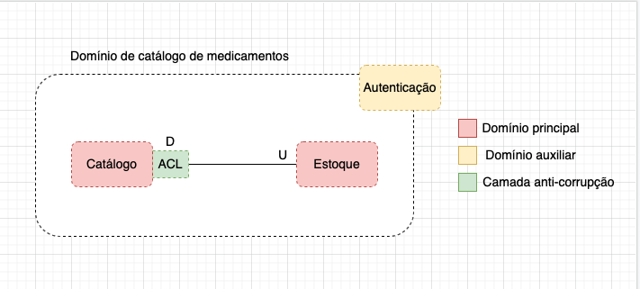
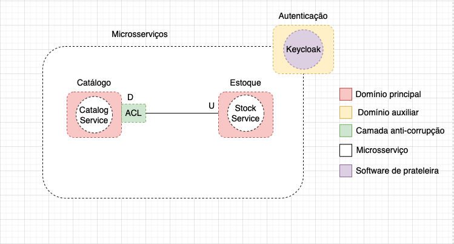
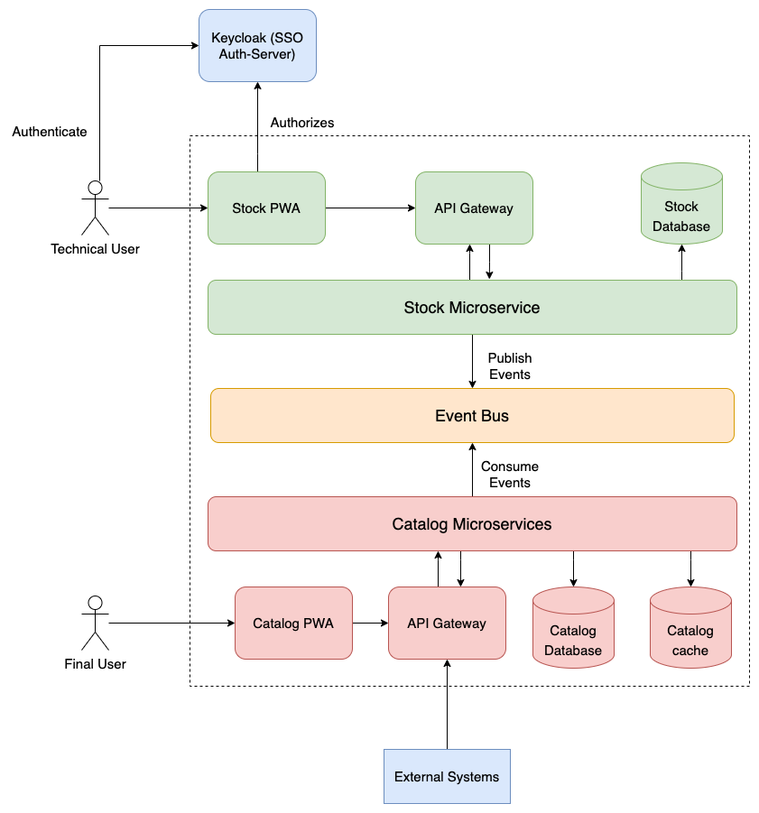
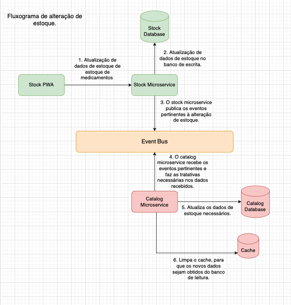
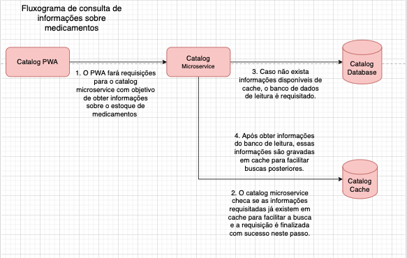
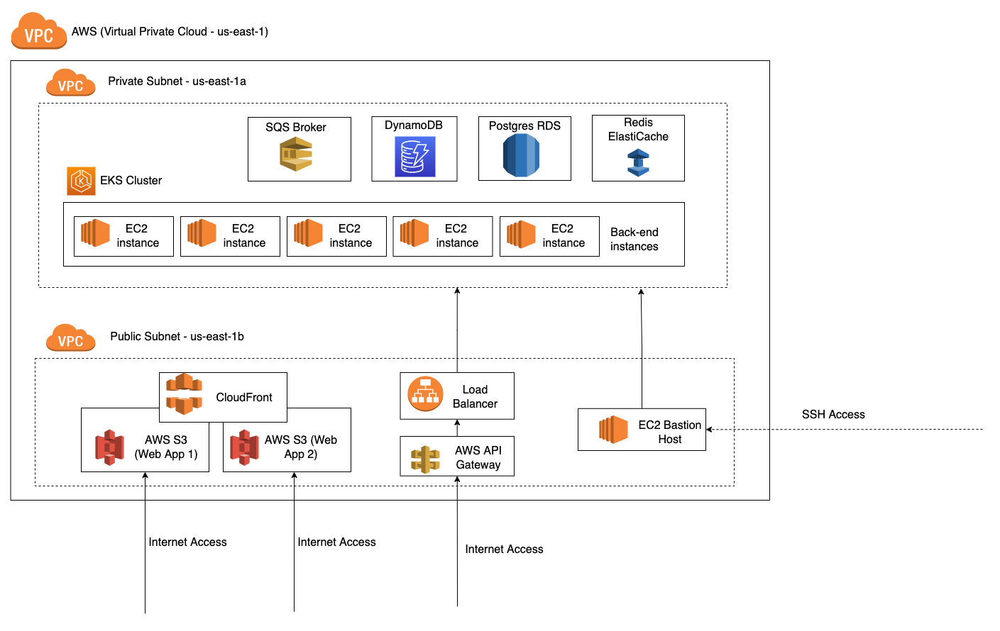
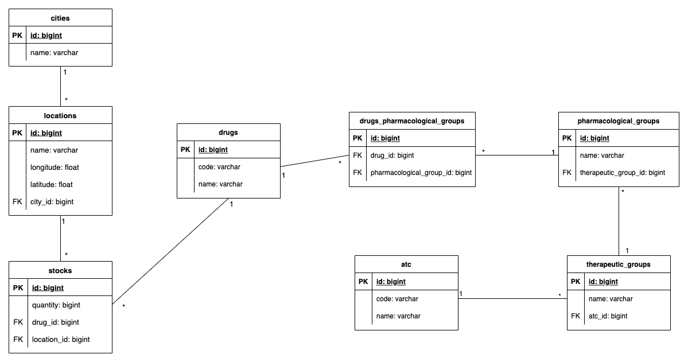

# DEFINIÇÃO DE ARQUITETURA E DESIGN DO PROJETO MEDICAMENTOS

## Contexto e Descrição Geral do Projeto

Cada município oferece em sua rede, medicamentos específicos em determinadas quantidades e em pontos geográficos diferentes. O objetivo deste projeto é fornecer uma plataforma que forneça de forma unificada um catálogo dos medicamentos oferecidos por determinado município.

[Diagrama de Contexto](https://s.icepanel.io/N6WxzShU96)

## Pontos importantes para definição da Arquitetura

De forma geral, foi dado como requisito que o software deverá ser escalável, configurável por município e possuir alta disponibilidade. Isso implica em alguns pontos importantes que podem ser  importantes para definição e planejamento da arquitetura:

* **Escalável**: isso implica que o software deve estar aberto à extensão de funcionalidades do software no futuro, bem como a possibilidade de aumentar a implantação e viabilização do software para novos municípios.

* **Disponibilidade de dados**: os dados referentes aos estoque de medicamentos devem ser possíveis de serem consumidos tanto pelo usuário final quanto por sistemas externos.

* **Alta disponibilidade**: por se tratar de um sistema da saúde, é desejável que o software tenha alta tolerância à falhas e uma infraestrutura segura que permita que o sistema minimize ao máximo o número interrupções no tráfego e indisponibilidade.
  
* **Integração com sistemas externos**: o software deve ser capaz de se integrar com sistemas e bases de dados externas a modo de obter informações sobre disponibilidade de remédios de cada município.

## Metodologia e quebra do domínio

Neste projeto, foi decidido a utilização de Domain-Driven Design para modelagem do no software requisitado. De forma que foi possível destrincharmos o domínio desta aplicação a fim de descobrir possíveis elementos de software a serem criados. Nesse âmbito, foi construído um Context Map para encontrarmos os contextos delimitados do nosso domínio de software (Catálogo de Medicamentos). Portanto, o produto produzido está ilustrado abaixo:

<br>

<div align=center>
  
</div>

<br>

Desse modo, encontramos dois contextos delimitados importantes para o funcionamento do negócio proposto pelo software:

* **Catálogo**: responsável por prover informações dados de medicamentos ao usuário final.
* **Estoque**: responsável por alimentar a base de dados com informações pertinentes à disponibilidade de medicamentos na rede pública de distribuição.

Além disso, é possível enxergar que um contexto de autenticação também foi identificado, com o objetivo de prover autenticação e segurança para o contexto de estoque. Uma vez que o contexto de catálogo deve ser aberto ao público geral que desejar utilizar o software.

<br>

## Elementos de Software definidos com base nos contextos delimitados

Uma vez definidos os contextos limitados do nosso domínio, vamos alocar elementos de software para esses contextos. Para isso, ao invés de uma modularização tradicional, foi escolhido a utilização de microsserviços. De forma que a seguinte distribuição de microsserviços para cada contexto foi feita:

<br>

<div align=center>
  
</div>

Como ilustrado, cada microsserviço foi alocado para um contexto principal. E para o contexto de autenticação foi decidido o uso de um software de prateleira open source amplamente utilizada para gestão de autenticação de software, o Keycloak.

<br>

## Detalhamento dos Microsserviços

* **stock-service**: este microsserviço será responsável por prover funcionalidades de atualização e cadastro de estoque dos administradores de medicamentos da rede pública de cada prefeitura. Dessa forma foi escolhido que este microsserviço manterá o estado atual consolidado do estoque de cada medicamento para um determinado ponto de distribuição, com isso, foi optado para utilização de um banco SQL (Postgres) para atuar em conjunto com este microsserviço, de modo a manter uma consistência transacional dos dados.

* **catalog-service**: este microsserviço será responsável por prover funcionalidades indexação e buscas de medicamentos e sincronização de dados em sua própria base dados com base em eventos de estoque fornecidas pelo microsserviço de estoque. Para facilitar busca e indexação, foi escolhido um banco NoSQL (DynamoDB), permitindo que estruturas de dados prontas para consumo sejam previamente preparadas, facilitando a busca de informações de medicamentos, melhorando substancialmente a performance de buscas em uma grande base de dados.

Em um momento posterior deste documento, será especificada a modelagem de dados para cada banco de dados, bem como os eventos de estoque transmitidos entre os microsserviços.

Dessa forma, podemos ver como ficaria disposição e os elementos dos microsserviços:

<br>

<div align=center>
  
</div>

<br>

Podemos notar que acompanhado de cada microsserviço, teremos uma PWA (progressive web app), que tem como objetivo fornecer uma interface web amigável para os atores do sistema. Então, temos:

* **stock-pwa**: responsável por prover as funcionalidades disponíveis no **stock-microservice**.

* **catalog-pwa**: responsável por prover as funcionalidades disponíveis no **catalog-microservice**.

Além disso, notamos um elemento intermeditário chamado **Event Bus**, se trata de um sistema de transmissão de eventos/mensagens para mediar a comunicação assíncrona entre os microsserviços explicitados. De forma abstraída, é possível considerar que este elemento faz parte da camada anti-corrupção citada anteriormente no mapa de contexto.

Vejamos alguns fluxos de interação entre os microsserviços que representam algumas funcionalidades providas por cada microsserviço:

### Fluxo alteração de estoque

<br>

<div align=center>
  
</div>

<br>

### Fluxo alteração de estoque
<br>
<div align=center>
  
</div>

<br>

## Ferramentas para Desenvolvimento do Software

Descrição de ferramentas, linguagens de programação, frameworks e serviços para implementação dos elementos de software.

Linguagens de programação:
Javascript/Typescript: linguagem moderna utilizada tanto para construção de aplicações server-side e client-side, com uma comunidade ativa e muitas opções de ferramentas disponíveis.

### Frameworks e ferramentas para construção:
* **Next.js**: construção de páginas web baseadas em server-side rendering, utilizando como base a biblioteca ReactJS.
* **Nodejs**: construção de aplicações back-end.
* **Docker e Kubernetes**: conteinerização, scaling e gerenciamento das instâncias da aplicação, bem como o provisionamento de ferramentas e ambiente eficaz para ambiente de desenvolvimento.
* **DynamoDB**: banco utilizado para armazenamento de informações utilizadas para leitura.
* **PostgreSQL**: banco utilizado para armazenamento de informações consolidadas.
* **Redis**: banco utilizado para armazenamento de cache de dados.

### Ferramentas de versionamento:
* **Git e Github**: para versionamento e armazenamento de código fonte.

### Ferramentas para integração e entrega contínua:
* **Drone CI**: ferramenta utilizada para construção de pipelines de integração contínua.
* **Argo CD**: ferramenta para realização de pipelines de entrega contínua em infraestruturas baseadas em Kubernetes.
* **ESLint**: ferramenta para linting de código Javascript/Typescript

### Serviços:

* **AWS VPC**: criação de redes internas.
* **AWS EKS**: administração de cluster Kubernetes.
* **AWS EC2**: disponibilização de máquinas em cloud.
* **ElastiCache**: provisionamento de instâncias de Redis gerenciado na cloud.
* **DynamoDB**: banco NoSQL gerenciado na cloud AWS.
* **AWS S3 e CloudFront**: serviços de distribuição de conteúdo estático web.
* **AWS RDS**: serviço gerenciado para provisionamento de bancos SQL padrões de mercado como MySQL e PostgreSQL.
* **AWS SQS**: serviço para troca de mensagens entre sistemas distribuídos no formato de filas de processamento.
* **AWS API Gateway**: serviço para gerenciamento de APIs.
* **AWS Route 53**: serviço para fornecimento de DNS.

## Decisões Arquiteturais

**Padrões Arquiteturais**: foram escolhidos alguns padrões a serem utilizados de modo a resolver os requisitos arquiteturais levantados:
  * **CQRS**: para deixar os dados em alta disponibilidade e tornar o software escalável e performático foi adotada a utilização do padrão CQRS, de modo que, dados que sejam necessários serem consultados com frequência e em formatos específicos, serão persistidas em coleções desnormalizadas separadas, indexadas justamente para otimização de buscas, aliando isso com estratégias de cache bem desenhadas. De modo que a informação original será persistida em uma base de dados transacional e normalizada, que seria a "fonte original da verdade".
  * **Microsserviços**: serão criados microsserviços específicos para cada funcionalidade, de modo a separar as responsabilidades corretamente e permitir uma escalabilidade horizontal de determinados serviços de acordo com a demanda.
  *  **Pub/Sub**: para sincronização entre as bases de leitura e escrita, será realizada a publicação de eventos assíncronos através de um barramento de mensagens, eventos estes que farão a replicação e atualização de dados entre as bases de dados.

<br>

**Amazon Web Services (AWS)**: para adequação de requisitos como escalabilidade e segurança, foi escolhida a utilização de serviços gerenciados na cloud AWS, que se caracteriza por alta resiliência e performance em seus serviços:
  * **AWS VPC**: será utilizada para manter que todas as transações e fluxos de comunicação sejam realizados em uma rede interna fechada para a internet, auxiliando na segurança de informações pertinentes ao software.
  * **AWS EKS**: uma vez decidida a utilização de Kubernetes, o serviço gerenciado permitirá que o cluster seja escalado horizontalmente de maneira fácil, com pouco esforço e bastante segurança.
  * **AWS EC2**: uma vez utilizado o EKS, o EC2 servirá para criação de cada nó do cluster Kubernetes.

<br>

## Diagrama de Infrastrutura do Software

Dessa forma, podemos ver a nível de infrastrutura na AWS, como estão dispostos os serviços escolhidos para a arquitetura do software.

<br>

<div align=center>
  
</div>

<br>

Vejamos alguns mapeamentos de como os serviços dispostos fornecem infrastrutura para os elementos de software mapeados:

* SQS <span>&#8594;</span> Event Bus
* DynamoDB <span>&#8594;</span> Catalog Database
* Postgres RDS <span>&#8594;</span> Stock Database
* Catalog Cache <span>&#8594;</span> Redis ElastiCache
* EKS Cluster <span>&#8594;</span> Microservices (Catalog and Stock)
* AWS S3 + CloudFront <span>&#8594;</span> PWAs (Catalog PWA and Stock PWA)


## Modelagem de Dados

### Stock Microservice

Para o microsserviço de estoque foi definida a utilização de uma modelagem entidade relacional tradicional para definir o esquema do banco de dados, vejamos o artefato produzido:

<div align=center>
  
</div>

<br>

### Catalog Microservice

Por se tratar de uma base de dados no SQL, a modelagem do banco de dados de catálogo foi definida em formato de JSON. Vejamos como foi definido:


```
{
    "stock": [
        {
            "locationId": "string",
            "drugId": "string",
            "quantity": "number"
        }
    ],
    "atc": [
        {
            "id": "UUID",
            "code": "string",
            "name": "string",
            "therapeuticGroups": [
                {
                    "id": "UUID",
                    "name": "string",
                    "pharmacologicalGroups": [
                        {
                            "id": "UUID",
                            "name": "string",
                            "drugs": [
                                "DRUG_ID_1",
                                "DRUG_ID_2",
                                "DRUG_ID_3"
                            ]
                        }
                    ]
                }
            ]
        }
    ],
    "cities": [
        {
            "id": "UUID",
            "name": "string"
        }
    ],
    "drugs": [
        {
            "id": "UUID",
            "genericName": "string",
            "activeIngredients": [
                {
                    "id": "UUID",
                    "name": "string"
                }
            ],
            "locations": [
                {
                    "id": "UUID",
                    "name": "string",
                    "cityId": "UUID",
                    "latitude": "string",
                    "longitude": "string"
                }
            ],
            "documentation": {
                "requiredToRequest": "string",
                "requiredToDistributionPoint": "string"
            }
        }
    ]
}
```

#### MODELAGEM DE CACHE

<br>

A seguinte representa os dados que serão persistidos em cache para acesso rápido.

Tempo de expiração para cada chave:
* ```list.act => 1 mês```
* ```list.therapeutic-groups#{actId} => 1 semana```
* ```list.pharmacological-groups#{therapeuticGroupId} => 1 semana```
* ```list.drugs#{pharmacologicalGroupId} => 1 semana```

```
{
    "list.act": [
        {
            "id": "string",
            "name": "string"
        }
    ],
    "list.therapeutic-groups#{actId}": [
        {
            "id": "string",
            "name": "string"
        }
    ],
    "list.pharmacological-groups#{therapeuticGroupId}": [
        {
            "id": "string",
            "name": "string"
        }
    ],
    "list.drugs#{pharmacologicalGroupId}": [
        {
            "id": "UUID",
            "genericName": "string",
            "activeIngredients": [
                {
                    "id": "UUID",
                    "name": "string"
                }
            ],
            "locationPoints": [
                {
                    "id": "UUID",
                    "name": "string",
                    "latitude": "string",
                    "longitude": "string",
                }
            ],
            "documentation": {
                "requiredToRequest": "string",
                "requiredToDistributionPoint": "string"
            }
        }
    ]
}
```

<br>

## MODELAGEM DE EVENTOS DE ESTOQUE

Já foi visto previamente que, em operações de estoque realizadas no seu respectivo microsserviço, eventos são gerados para sincronização do catalógo de medicamentos. Vejamos as especificações e payloads dos eventos gerados:

<br>

### **ON_STOCK_UPDATED**

Descrição: realizado quando algum remédio tem seu estoque atualizado para determinada localização.

```
{
    "type": "INCOME" | "OUTCOME",
    "drugId": "UUID",
    "locationId":  "UUID",
    "value": "number"
}
```

### **ON_DRUG_REMOVED**

Descrição: realizado quando algum remédio é removido do catálogo para determinada localização.

```
{
    "drugId": "UUID",
    "locationId":  "UUID"
}
```

### **ON_DRUG_ADDED**

Descrição: realizado quando algum remédio é adicionado do catálogo de uma determinada localização.

```
{
    "drugId": "UUID",
    "locationId":  "string",
    "initialQuantity: "number"
}
```


